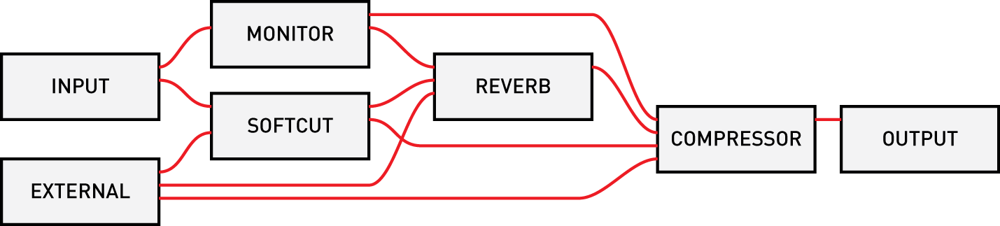

# norns reference 2.0.0

## basic form

```
-- scriptname: short script description
-- v1.0.0 @author
-- llllllll.co/t/22222

engine.name = 'polysub'

function init()
  -- initialization
end

function key(n,z)
  -- key actions: n = number, z = state
end

function enc(n,d)
  -- encoder actions: n= number, z = state
end

function redraw()
  -- screen redraw
end
```


## core

### softcut

- `softcut.level(voice, value)` :	set level of each voice
- `softcut.pan(voice, value)` :	set pan of each voice
- `softcut.level_input_cut(ch, voice, value)` :	set input level to each voice/channel
- `softcut.level_cut_cut(src, dst, value)` :	set mix matrix, voice output to voice input
- `softcut.play(voice, state)` :	set play status
- `softcut.loop_start(voice, value)` :	set loop start
- `softcut.loop_end(voice, value)` :	set loop end
- `softcut.loop(voice, state)` :	set loop mode
- `softcut.fade_time(voice, value)` :	set fade time
- `softcut.rec_level(voice, value)` :	set record level
- `softcut.pre_level(voice, value)` :	set pre level (overdub preserve)
- `softcut.rec(voice, state)` :	set record status
- `softcut.rec_offset(voice, value)` :	set record head offset
- `softcut.position(voice, value)` :	set play position
- `softcut.buffer(i, b)` :	specify buffer used by voice
- `softcut.voice_sync(src, dest, v)` :	sync two voices
- `softcut.filter_fc(voice, value)` :	set filter cutoff
- `softcut.filter_fc_mod(voice, value)` :	set filter mod
- `softcut.filter_rq(voice, value)` :	set filter q
- `softcut.filter_lp(voice, value)` :	set filter lp
- `softcut.filter_hp(voice, value)` :	set filter hp
- `softcut.filter_bp(voice, value)` :	set filter bp
- `softcut.filter_br(voice, value)` :	set filter br
- `softcut.filter_dry(voice, value)` :	set filter dry
- `softcut.level_slew_time(voice, value)` :	set level slew time
- `softcut.rate_slew_time(voice, value)` :	set rate slew time
- `softcut.phase_quant(voice, value)` :	set phase poll quantization
- `softcut.poll_start_phase()` :	start phase poll
- `softcut.poll_stop_phase()` :	stop phase poll
- `softcut.enable(voice, state)` :	set voice enable
- `softcut.buffer_clear()` :	clear all buffers
- `softcut.buffer_clear_channel(i)` :	clear one channel of buffer
- `softcut.buffer_clear_region(start, stop)` :	clear region (both channels)
- `softcut.buffer_clear_region_channel(ch, start, stop)` :	clear region of single channel
- `softcut.buffer_read_mono(file, start_src, start_dst, dur, ch_src, ch_dst)` :	read file to one channel
- `softcut.buffer_read_stereo(file, start_src, start_dst, dur)` :	read file, stereo
- `softcut.event_phase(f)` :	set function for phase poll
- `softcut.reset()` :	reset softcut params
- `softcut.params()` :	controlspec factory each table contains an entry for each softcut parameter.

### engine

### polls


### screen

screen.update ()	copy buffer to screen.
screen.aa (state)	enable/disable anti-aliasing.
screen.clear ()	clear.
screen.level (value)	set level (color/brightness).
screen.line_width (w)	set line width.
screen.line_cap (style)	set line cap style.
screen.line_join (style)	set line join style.
screen.miter_limit (limit)	set miter limit.
screen.move (x, y)	move drawing position.
screen.move_rel (x, y)	move drawing position relative to current position.
screen.line (x, y)	draw line to specified point.
screen.line_rel (x, y)	draw line to specified point relative to current position.
screen.arc (x, y, r, angle1, angle2)	draw arc.
screen.circle (x, y, r)	draw circle.
screen.rect (x, y, w, h)	draw rectangle.
screen.curve (x1, y1, x2, y2, x3, y3)	draw curve (cubic Bézier spline).
screen.curve_rel (x1, y1, x2, y2, x3, y3)	draw curve (cubic Bézier spline) relative coordinates.
screen.close ()	close current path.
screen.stroke ()	stroke current path.
screen.fill ()	fill current path.
screen.text (str)	draw text (left aligned).
screen.text_right (str)	draw text, right aligned.
screen.text_center (str)	draw text, center aligned.
screen.font_face (index)	select font face.
screen.font_size (size)	set font size.
screen.pixel (x, y)	draw single pixel (requires integer x/y, fill afterwards).
screen.display_png (filename, x, y)	display png.

### metro

metro.init (arg, arg_time, arg_count)	initialize a metro.
metro:start (time, count, stage)	start a metro.
metro:stop ()	stop a metro.

### params


### grid

### arc

### midi

### hid

### osc


## audio routing



## audio params

param |range |description
---|---|---
output            |[-inf, 0] db     |output level
input             |[-inf, 0] db     |input level
monitor           |[-inf, 0] db     |monitor level (input mix to ouput)
ext               |[-inf, 0] db     |external application level (ie, supercollider)
softcut           |[-inf, 0] db     |multivoice sampler level
tape              |[-inf, 0] db     |tape playback level
monitor mode      |[MONO, STEREO]   |MONO = mix input 1 and 2 to both channels
headphone         |[0, 60]          |headphone gain
reverb            |[ON, OFF]        |reverb state
rev ext input     |[-inf, 12] db    |external input to reverb
rev cut input     |[-inf, 12] db    |softcut input to reverb
rev monitor input |[-inf, 12] db    |monitor input to reverb
rev return level  |[-inf, 12] db    |reverb return level
rev pre delay     |[20, 100] ms     |delay before reverberation
rev lf fc         |[50, 1000] hz    |crossover frequency between low and middle bands
rev low time      |[1, 32] s        |time to decay by 60dB in low band
rev mid time      |[1, 32] s        |time to decay by 60dB in mid band
rev hf damping    |[1500, nyq] hz   |frequency at which high band decay time is 1/2 of mid band decay time
compressor        |[ON, OFF]        |compressor state
comp mix          |[0, 1.0]         |dry/wet mix. 0 = dry, 1 = wet
comp ratio        |[1, 20]          |compression ratio: for each N dB increase in input level above threashold, output level increases by 1dB
comp threshold    |[-100, 10] dB    |amplitutde above which the signal is compressed
comp attack       |[1, 1000] ms     |time constant (1/e smoothing time) for compression gain to exponentially approach a new _lower_ target level
comp release      |[1, 1000] ms     |time constant (1/e smoothing time) for compression gain to exponentially approach a new _higher_ target level
comp pre gain     |[-inf, 30] db    |gain pre compression
comp post gain    |[-inf, 30] db    |gain post compression


## further

https://monome.org/docs/norns
https://github.com/monome/norns
